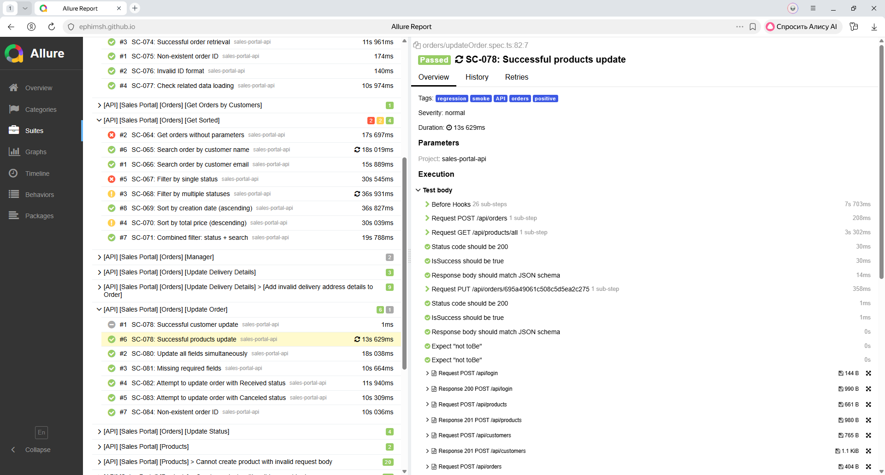
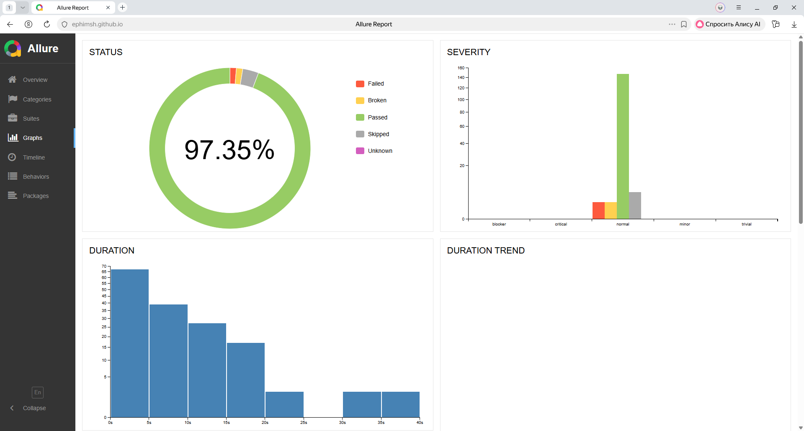
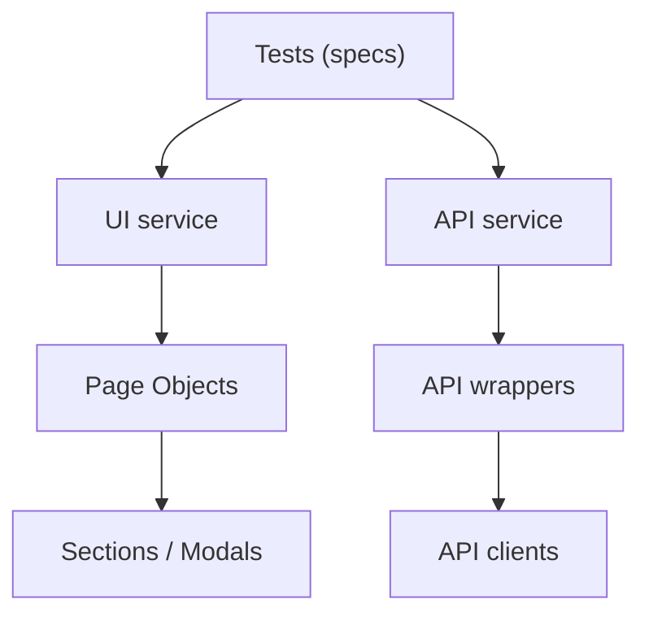
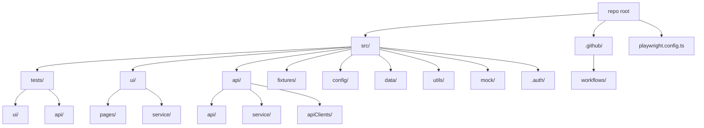

# Учебный проект автоматизации тестирования для приложения sales-portal

Минимальные шаги для запуска проекта автотестов

## Требования

- Node.js 18+ (рекомендуется LTS)
- npm (устанавливается вместе с Node.js)

## Настройка окружения

1. Скопируйте файл `.env.dist` в `.env`.
2. Заполните переменные в `.env`:
   - `ENV` — имя окружения (например, `local`, `prod` ).
   - `USER_NAME` — логин пользователя для входа.
   - `USER_PASSWORD` — пароль пользователя.
   - `SALES_PORTAL_URL` — URL фронта портала продаж.
   - `SALES_PORTAL_API_URL` — URL API портала продаж.

## Установка зависимостей

```bash
npm install
```

При необходимости установите браузеры Playwright:

```bash
npx playwright install
```

## Запуск тестов

```bash
npm run test
```

### UI

```bash
npm run test:ui:smoke
npm run test:ui:regression
```

### API

```bash
npm run test:api
```

## Репортинг

- Allure: результаты сохраняются в `allure-results/`, отчет генерируется командой `npm run allure-report` (вывод в `allure-report/`). Для открытия локально: `npm run allure-report-open`.
- Telegram: уведомление отправляется из CI (шаг `Notify Telegram with Allure link`) в `.github/workflows/ui.yml` и `.github/workflows/api.yml`.

Переменные окружения для Telegram-репортинга:

- `TELEGRAM_BOT_TOKEN` - токен бота.
- `TELEGRAM_CHAT_ID` - id чата/канала.

Список тестов:



График выполнения тестов:



## Список тестов

<details>
<summary>API</summary>

<details>
<summary>customers</summary>

- SC-027: Successful customer creation
- SC-028: Create customer without optional field notes
- SC-029: Invalid email format
- SC-030: Invalid country (not from enum list)
- SC-032: Missing required fields (phone)
- SC-031: Duplicate email
- Delete Customer by ID via API
- Delete Customer by ID for the second time via API
- Delete Customer with invalid ID via API
- Get All Customers via API
- Get All Customers without Token via API
- Get All Customers with incorrect Token via API
- SC-041: Successful customer retrieval by valid ID
- SC-042: Invalid customer ID format ("123")
- SC-043: Get customer by non-existent ID (valid format)
- Search Customers by name
- Search Customers by email
- Search Customers by country
- Sort by: SortField: name, sortOrder: asc
- Sort by: SortField: name, sortOrder: desc
- Sort by: SortField: country, sortOrder: asc
- Sort by: SortField: country, sortOrder: desc
- Sort by: SortField: createdOn, sortOrder: asc
- Sort by: SortField: createdOn, sortOrder: desc

</details>

<details>
<summary>notifications</summary>

- Succesed getting notification list
- Request without authorization token
- Succesed all notifications marked
- Request without authorization token
- Succesed one notification mark
- Request without authorization token
- Request without notification Id

</details>

<details>
<summary>orders</summary>

- Add valid comment to Order
- Add multiple comments to Order
- Add empty comment to Order
- Add very long comment to Order
- SC-054: Successful order creation
- SC-055: Create order with multiple products
- SC-108: Successful delivery data creation
- SC-101: Successful status update Draft → In Process
- SC-102: Status update In Process → Canceled
- SC-056: Missing required field customer
- SC-057: Missing required field products
- SC-058: Empty products arrays
- SC-059: Non-existent customer ID
- SC-060: Invalid customer ID format
- SC-061: Non-existent product ID in array
- SC-062: Check delivery field in response
- SC-063: Check order history creation
- Delete comment from Order
- Delete multiple comments from Order
- Delete non-existing comment from Order
- Delete comment with invalid Order ID
- SC-074: Successful order retrieval
- SC-077: Check related data loading
- SC-065: Search order by customer name
- SC-064: Get orders without parameters
- SC-065: Search order by customer name
- SC-066: Search order by customer email
- SC-067: Filter by single status
- SC-068: Filter by multiple statuses
- SC-069: Sort by creation date (ascending)
- SC-070: Sort by total price (descending)
- SC-071: Combined filter: status + search
- SC-091: Successful manager assignment
- SC-097: Successful manager unassignment
- SC-108: Successful delivery data creation
- SC-109: Update existing delivery data
- SC-117: Non-existent order ID
- SC-078: Successful customer update
- SC-078: Successful products update
- SC-080: Update all fields simultaneously
- SC-081: Missing required fields
- SC-082: Attempt to update order with Received status
- SC-083: Attempt to update order with Canceled status
- SC-084: Non-existent order ID
- Update status of Order to => InProcess
- Update status of Order to => Partially Received
- Update status of Order to => Received
- Update status of Order to => Canceled

</details>

<details>
<summary>products</summary>

- SC-001: Successful product creation with all fields
- SC-003: Name validation error (name is not a string)
- SC-001: Successful product creation with all fields
- SC-002: Create product without optional field notes
- SC-003: Missing required field name
- SC-004: Invalid manufacturer (not from enum list)
- SC-005: Negative numbers in amount and price
- SC-006: Incorrect Content-Type
- SC-023: Successful product deletion
- SC-024: Delete the same product again
- SC-025: Delete product with associated orders
- SC-026: Delete with invalid ID
- SC-007: Receiving goods without parameters
- SC-008: Filter by one manufacturer
- SC-009: Filter by multiple manufacturers
- SC-010: Search by product name
- SC-011: Sort by price, ascending
- SC-012: Sort by creation date (newest first)
- SC-015: Successful receipt of goods by valid ID
- SC-016: Receiving a non-existent product
- SC-010: Search product by name
- SC-010: Search product by price (string search)
- SC-010: Search product by manufacturer
- SC-012: Sort by createdOn (asc)
- SC-012: Sort by createdOn (desc)
- SC-011: Sort by manufacturer (desc)
- SC-018: Full product update
- SC-019: Partial update (price only)
- SC-020: Update non-existent product
- SC-021: Update with invalid name
- SC-022: Update with negative amount

</details>

</details>

<details>
<summary>UI</summary>

<details>
<summary>orders</summary>

- Add comment to Order
- Remove comment from Order
- SC-091: Successful manager assignment
- SC-091: Successful manager change
- SC-097: Successful manager unassignment
- Status is Draft on Order Details page
- Status is In Process on Order Details page
- Status is Partially Received on Order Details page
- Status is Received on Order Details page
- Status is Canceled on Order Details page
- Refresh Order
- SC-025: Delete Product From Order
- Create delivery with Customer Home address
- Create delivery with Other address entierly different from Customer address
- Create pickup in same country as Customer
- Create pickup in different country than Customer

</details>

</details>

## Архитектура

- Tests - `src/tests/**`: сценарии и проверки.
- Service - `src/ui/service/**`, `src/api/service/**`: бизнес-операции и композиция шагов.
- Pages / API wrappers - `src/ui/pages/**`, `src/api/api/**`: Page Objects и обертки над эндпоинтами.
- Components / Clients - `src/ui/pages/**` (sections/modals) и `src/api/apiClients/**`: локаторы и низкоуровневые клиенты.



## Файловая структура

- `src/tests/ui` - UI спецификации (Playwright).
- `src/tests/api` - API спецификации.
- `src/ui/pages` - Page Objects, базовые страницы, модалки и секции.
- `src/ui/service` - UI сервисы: высокоуровневые действия (flows) поверх страниц.
- `src/api/api` - обертки над эндпоинтами.
- `src/api/service` - бизнес-сценарии поверх API.
- `src/api/apiClients` - базовые API клиенты и типы.
- `src/fixtures` - Playwright fixtures (API/UI сервисы, страницы).
- `src/config` - конфиги окружения и teardown.
- `src/data` - тестовые данные, типы, схемы.
- `src/utils` - репортинг, env, валидации, утилиты.
- `src/mock` - мок-данные/заглушки.
- `src/.auth` - сохраненные состояния авторизации.
- `.github/workflows` - CI пайплайны.
- `playwright.config.ts` - конфигурация Playwright.

<details>
<summary> Схема файловой структуры </summary>



</details>
